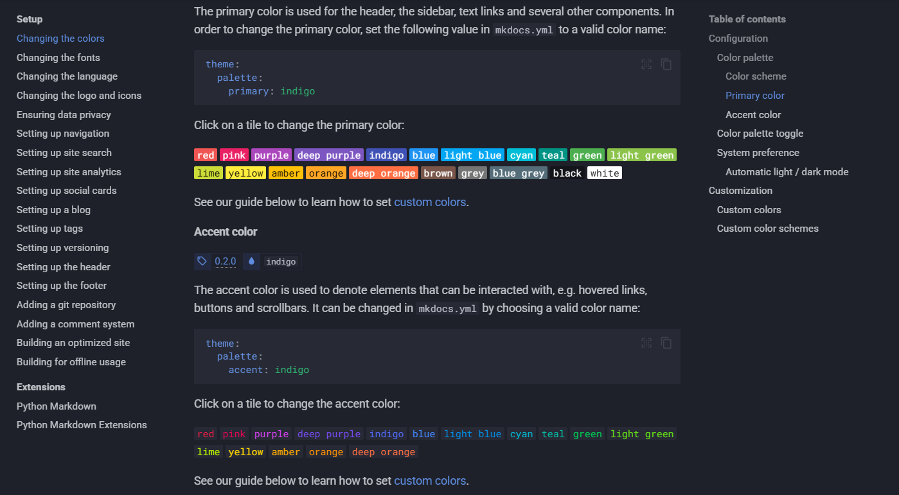
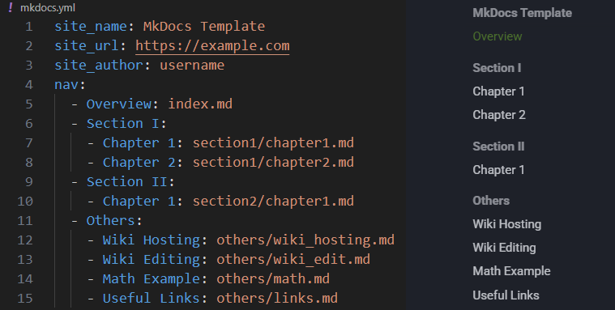

# Wiki Contents Editing
While hosting the wiki locally, the page automatically reloads to reflect any changes you make without the need to deploy the page. This makes it easy to see your updates in real time. Refer to the [previous section](wiki_hosting.md) for instructions on how to achieve that.

## Website Appearance
The appearance of the website can be customized by editing the `./mkdocs.yml` configuration file. It allows you to modify themes, colors, fonts, and other visual elements of the wiki. 

!!! tip
    For a full list of customization options, visit the official [Setup](https://squidfunk.github.io/mkdocs-material/setup/) Guide.

## Navigation Structure
Edit `./mkdocs.yml` to control the overall organization and hierarchy of the wiki content. This way you can specify:

* Which Markdown files correspond to each page
* The page order
* The page titles

## Page Editing
To edit a specific page in the wiki, modify the corresponding Markdown (`.md`) file. Material for MkDocs syntax provides plenty of options to format text, create code blocks, insert annotations, add links, or include other interactive elements.

!!! tip
    For a comprehensive list of all available syntax and features, refer to the official [Material for MkDocs Reference](https://squidfunk.github.io/mkdocs-material/reference/). This page includes detailed documentation on everything you can do within your Markdown files.

